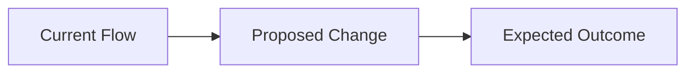

## 💡 Feature Description

A clear description of the feature or enhancement you'd like to propose.

## 🤖 Affected Mode(s)

Which mode(s) would this affect?

- [ ] Orchestrator (`orchestrator`)
- [ ] Ask (`ask`)
- [ ] Architect (`architect`)
- [ ] Subtask Orchestrator (`subtask-orchestrator`)
- [ ] Git (`git`)
- [ ] **New mode** — proposed slug: ``

## 🎯 Problem Statement

What problem does this solve? What limitation have you encountered in the current agent stack?

## 🔄 Pipeline Integration

How would this feature integrate into the existing orchestration pipeline?

## 📋 Proposed Behavior

Describe the expected behavior in detail:

1. **Trigger:** When should this behavior activate?
2. **Input:** What context does it need?
3. **Output:** What should it produce?
4. **Handoff:** How does it pass control to the next mode?

## 🧪 Testing Plan

How would you verify this works correctly within the full pipeline?

- [ ] Tested in isolation with the mode imported
- [ ] Tested within the full pipeline (all modes active)
- [ ] Verified no regression in other modes

## 📝 Additional Context

Any other information, examples from other tools, or reference implementations.
