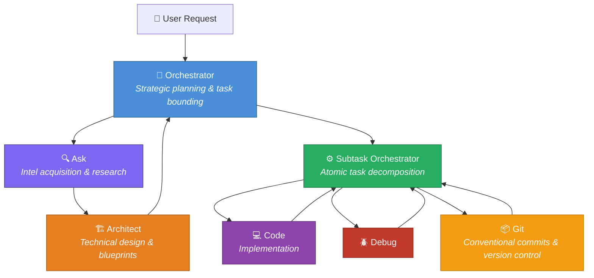
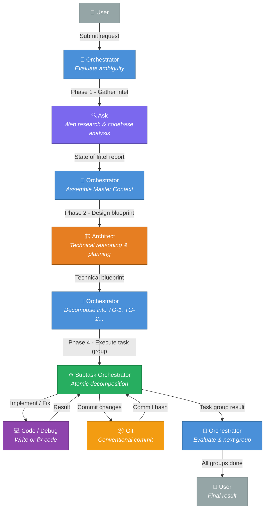
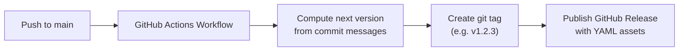

<div align="center">

# 🎯 RooForge

**A structured multi-agent orchestration system for [Roo Code](https://github.com/RooCodeInc/Roo-Code)**

A hierarchical pipeline of specialized AI modes - from strategic planning to atomic execution.

[](LICENSE)
[](../../releases/latest)
[](https://conventionalcommits.org)

</div>

---

## 📋 Overview

This project provides a curated set of **custom mode export files** that define a disciplined, multi-layered agent orchestration workflow for Roo Code. Each mode is a specialist with a clearly defined role, and together they form a strict pipeline that ensures every task is properly researched, planned, decomposed, executed, and committed.

## 🔄 The Pipeline



### Pipeline Phases

| Phase | Mode | Purpose |
|-------|------|---------|
| **1 - Intel** | Ask | Eliminate unknowns via web research & codebase analysis |
| **2 - Design** | Architect | Produce a detailed technical blueprint |
| **3 - Plan** | Orchestrator | Decompose blueprint into bounded task groups |
| **4 - Execute** | Subtask Orchestrator | Break task groups into atomic subtasks |
| **5 - Implement** | Code / Debug | Write or fix code |
| **6 - Commit** | Git | Validate, stage, and commit with conventional messages |

## 🤖 Modes

| Mode | File | Description |
|------|------|-------------|
| **Orchestrator** | [`agents/orchestrator-export.yaml`](agents/orchestrator-export.yaml) | Strategic entry point. Performs high-level task bounding, enforces the pipeline, and delegates to specialized modes. |
| **Ask** | [`agents/ask-export.yaml`](agents/ask-export.yaml) | Intelligence specialist. Performs web research, codebase analysis, and generates "State of Intel" reports. |
| **Architect** | [`agents/architect-export.yaml`](agents/architect-export.yaml) | Technical leader. Creates detailed blueprints, system designs, and structured plans from gathered intelligence. |
| **Subtask Orchestrator** | [`agents/subtask-orchestrator-export.yaml`](agents/subtask-orchestrator-export.yaml) | Execution manager. Decomposes task groups into the smallest atomic units and delegates to implementation specialists. |
| **Git** | [`agents/git-export.yaml`](agents/git-export.yaml) | Version control specialist. Handles conventional commits, branch management, and repository integrity. |

## 🧩 Mode Interaction Flow



## 🚀 Installation

1. **Download** the export YAML files from the [latest release](../../releases/latest).
2. Open **Roo Code** in VS Code.
3. Navigate to **Roo Code Settings → Custom Modes**.
4. Click **Import** and select the downloaded `.yaml` file(s).
5. The modes will appear in your mode selector.

> **Tip:** Import all five modes for the full orchestration pipeline experience.

## 🔄 Automated Releases

This repository uses **automated semantic versioning** powered by [Conventional Commits](https://www.conventionalcommits.org/):



### Commit Convention

| Prefix | Version Bump | Example |
|--------|-------------|---------|
| `feat:` | **Minor** | `feat: add debug mode export` |
| `fix:` | **Patch** | `fix: correct orchestrator role definition` |
| `feat!:` or `BREAKING CHANGE` | **Major** | `feat!: redesign pipeline architecture` |
| `docs:` | None | `docs: update README` |
| `chore:` | None | `chore: update workflow` |
| `refactor:` | None | `refactor: simplify subtask logic` |
| `test:` | None | `test: add validation for exports` |

## 🧪 Optional Addons

### Caveman - Token-Efficient Communication

An optional [Caveman](https://github.com/JuliusBrussee/caveman) addon that enforces ultra-terse communication across the entire orchestration stack. Cuts ~65% of output tokens while keeping full technical accuracy.

**Quick install:**
```bash
npx skills add JuliusBrussee/caveman
# Select "Roo Code" when prompted
```

For full setup instructions, Global Custom Instructions block, compression levels, and the experimental cavereason mode - see the complete guide at **[`addons/caveman.md`](addons/caveman.md)**.

## 🔌 MCP Servers

The orchestration pipeline requires two MCP (Model Context Protocol) servers for full functionality. These servers extend the capabilities of specific modes in the pipeline.

| Server | File | Required By | Purpose |
|--------|------|-------------|---------|
| **SearXNG** | [`mcp/searxng.md`](mcp/searxng.md) | Ask | Web search & URL reading |
| **Git MCP** | [`mcp/git-mcp-server.md`](mcp/git-mcp-server.md) | Git | Git operations (CLI fallback) |

> 💡 See each server's documentation for full setup instructions, configuration details, and usage examples.

## 📁 Repository Structure

```
.
├── .github/
│   ├── workflows/
│   │   └── release.yml              # Auto-versioning & release workflow
│   └── ISSUE_TEMPLATE/              # Bug reports, features, questions
├── agents/
│   ├── README.md                    # Agent modes directory overview
│   ├── orchestrator-export.yaml     # Orchestrator mode
│   ├── subtask-orchestrator-export.yaml  # Subtask Orchestrator mode
│   ├── architect-export.yaml        # Architect mode
│   ├── ask-export.yaml              # Ask (research) mode
│   └── git-export.yaml              # Git mode
├── addons/
│   ├── README.md                    # Addons directory overview
│   └── caveman.md                   # Caveman addon setup guide
├── mcp/
│   ├── README.md                    # MCP servers directory overview
│   ├── searxng.md                   # SearXNG MCP server setup (Ask mode)
│   └── git-mcp-server.md            # Git MCP server setup (Git mode)
├── CONTRIBUTING.md                  # Contribution guidelines
├── LICENSE                          # Apache License 2.0
└── README.md                        # This file
```

## 🤝 Contributing

We welcome community involvement! However, please note that **pull requests are not automatically accepted**. All contributions go through an evaluation process.

See [**CONTRIBUTING.md**](CONTRIBUTING.md) for full details on:
- Our PR evaluation process
- Conventional Commits (extended) requirements
- Feature branch workflow
- Testing expectations

## 📄 License

Licensed under the [Apache License 2.0](LICENSE).

```
Copyright 2026 weselben

Licensed under the Apache License, Version 2.0 (the "License");
you may not use this file except in compliance with the License.
You may obtain a copy of the License at

    http://www.apache.org/licenses/LICENSE-2.0

Unless required by applicable law or agreed to in writing, software
distributed under the License is distributed on an "AS IS" BASIS,
WITHOUT WARRANTIES OR CONDITIONS OF ANY KIND, either express or implied.
See the License for the specific language governing permissions and
limitations under the License.
```

## ⭐ Acknowledgments

- Built for [Roo Code](https://github.com/RooCodeInc/Roo-Code) - an AI-powered coding assistant for VS Code.
- Inspired by hierarchical task decomposition and multi-agent orchestration patterns.
- [Caveman](https://github.com/JuliusBrussee/caveman) by JuliusBrussee - token-efficient communication skill for AI agents.

---

<div align="center">

**[⬆ Back to top](#-rooforge)**

</div>
