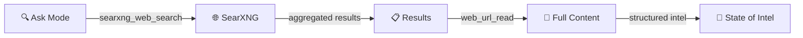

<div align="center">

# 🔍 SearXNG MCP Server

**Privacy-respecting meta-search for Ask mode web intelligence**

[](https://github.com/searxng/searxng)
[](https://www.npmjs.com/package/@anthropic/mcp-searxng)

*Privacy-first search · No API keys · Self-hosted*

</div>

---

## 💡 The Idea

Ask mode is the intelligence-gathering phase of our pipeline. It needs real-time web access — library docs, API references, version compatibility, best practices. Without it, Ask mode is limited to stale training data.

[SearXNG](https://github.com/searxng/searxng) solves this. It's a privacy-respecting meta-search engine that aggregates results from 70+ search engines. The `mcp-searxng` package exposes two MCP tools — `searxng_web_search` for queries and `web_url_read` for full content extraction — giving Ask mode the web intelligence it needs without leaking queries to third parties.



## 🔧 Available Tools

| Tool | Purpose | Key Parameters |
|------|---------|----------------|
| `searxng_web_search` | Search the web via SearXNG | `query`, `pageno`, `time_range`, `language`, `safesearch` |
| `web_url_read` | Read full content from a URL | `url`, `startChar`, `maxLength`, `section`, `paragraphRange`, `readHeadings` |

<details>
<summary>📖 Full Parameter Reference</summary>

### `searxng_web_search`

| Parameter | Type | Required | Default | Description |
|-----------|------|----------|---------|-------------|
| `query` | `string` | ✅ | — | The search query |
| `pageno` | `number` | ❌ | `1` | Search page number (starts at 1) |
| `time_range` | `"day"` \| `"month"` \| `"year"` | ❌ | — | Time range filter |
| `language` | `string` | ❌ | `"all"` | Language code (e.g. `en`, `fr`, `de`) |
| `safesearch` | `0` \| `1` \| `2` | ❌ | `0` | Safe search level (0: None, 1: Moderate, 2: Strict) |

### `web_url_read`

| Parameter | Type | Required | Default | Description |
|-----------|------|----------|---------|-------------|
| `url` | `string` | ✅ | — | URL to read content from |
| `startChar` | `number` | ❌ | `0` | Starting character position for extraction |
| `maxLength` | `number` | ❌ | — | Maximum number of characters to return |
| `section` | `string` | ❌ | — | Extract content under a specific heading |
| `paragraphRange` | `string` | ❌ | — | Return specific paragraph ranges (e.g. `1-5`, `3`, `10-`) |
| `readHeadings` | `boolean` | ❌ | — | Return only headings instead of full content |

</details>

## 🚀 Setup

### Step 1: Deploy SearXNG

Run SearXNG locally via Docker:

```bash
docker run -d \
  --name searxng \
  -p 8080:8080 \
  -e SEARXNG_BASE_URL=http://localhost:8080/ \
  -v searxng-data:/etc/searxng \
  searxng/searxng:latest
```

> 💡 For production, add `SEARXNG_SECRET` and configure `settings.yml` for rate limiting and enabled engines.

### Step 2: Configure MCP Server

Add to your Roo Code MCP settings (`~/.config/Code - OSS/User/globalStorage/rooveterinaryinc.roo-cline/settings/mcp_settings.json`):

```json
{
  "mcpServers": {
    "searxng": {
      "command": "bunx",
      "args": ["-y", "@anthropic/mcp-searxng"],
      "env": {
        "SEARXNG_URL": "http://localhost:8080/"
      }
    }
  }
}
```

> ⚠️ Replace `http://localhost:8080/` with your SearXNG instance URL if different.

### Step 3: Verify

1. Restart Roo Code
2. Switch to **Ask mode**
3. Ask a question requiring web search
4. Confirm `searxng_web_search` appears in available tools

<details>
<summary>📖 What does `alwaysAllow` do?</summary>

By default, Roo Code asks for confirmation before each MCP tool call. Adding tool names to `alwaysAllow` skips confirmation for those tools. This is recommended for `searxng_web_search` and `web_url_read` since Ask mode relies on frequent search/read cycles during intel gathering.

To enable, add to the MCP server config:

```json
{
  "mcpServers": {
    "searxng": {
      "command": "bunx",
      "args": ["-y", "@anthropic/mcp-searxng"],
      "env": {
        "SEARXNG_URL": "http://localhost:8080/"
      },
      "alwaysAllow": [
        "searxng_web_search",
        "web_url_read"
      ]
    }
  }
}
```

</details>

## 📊 Impact on the Stack

| Mode | Role | Access |
|------|------|--------|
| 🎯 **Orchestrator** | Delegates to Ask mode | Indirect (via Ask) |
| 🔍 **Ask** | Primary consumer — web search, URL reading, intel gathering | **Direct** |
| 🏗️ **Architect** | Uses Ask's findings for blueprints | Indirect (via Ask) |
| ⚙️ **Subtask Orchestrator** | Executes architect blueprints | Indirect (via Ask) |
| 📦 **Git** | Version control operations | None |

## 🔗 Links

- **SearXNG:** [github.com/searxng/searxng](https://github.com/searxng/searxng)
- **mcp-searxng (npm):** [npmjs.com/package/@anthropic/mcp-searxng](https://www.npmjs.com/package/@anthropic/mcp-searxng)

---

<div align="center">

*[⬆ Back to README](../README.md)*

</div>
